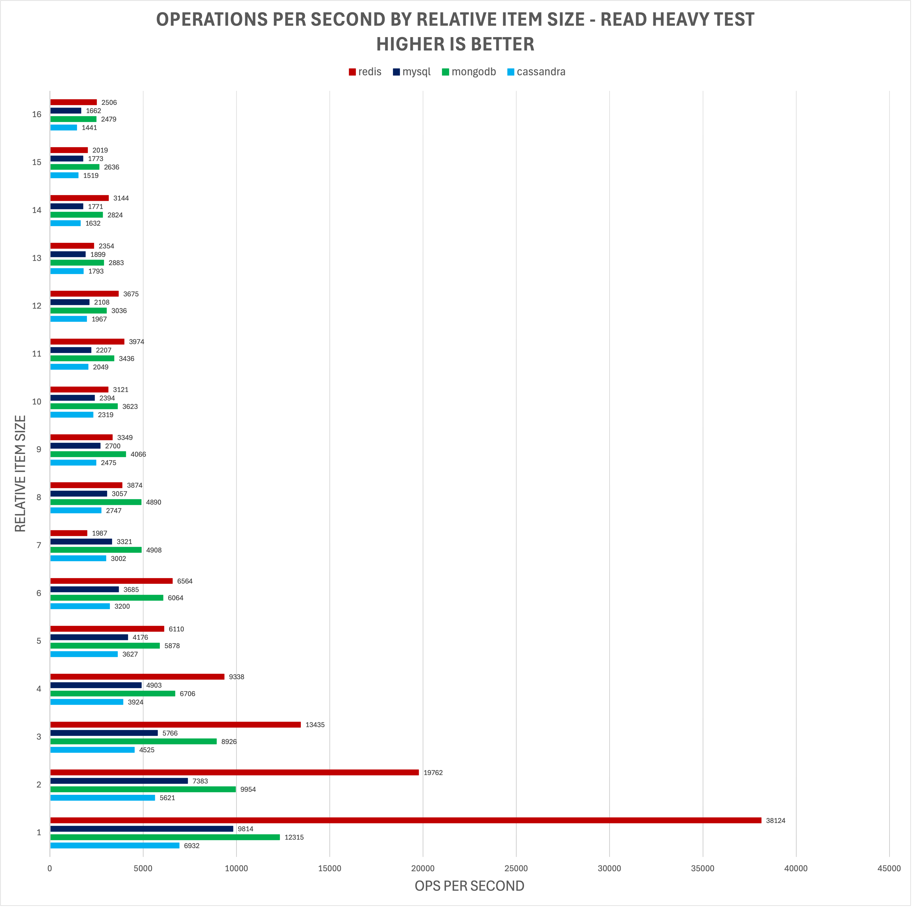
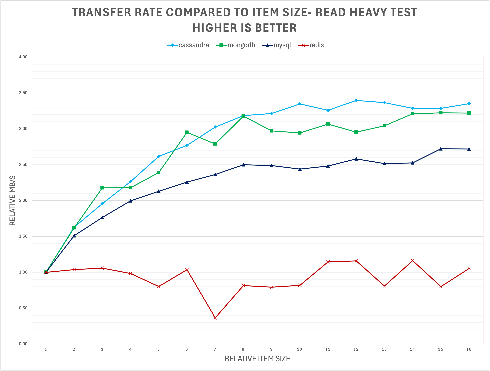
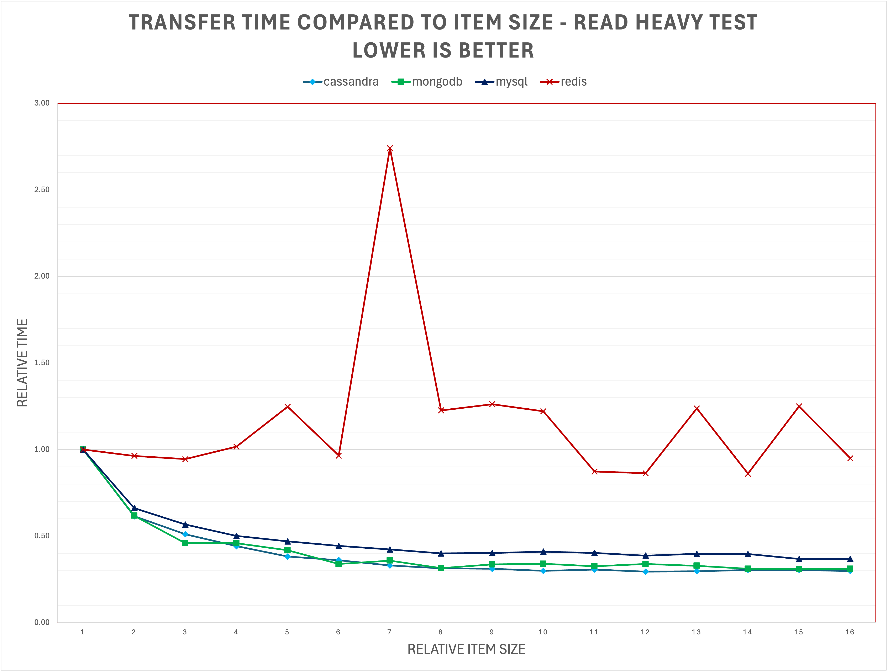
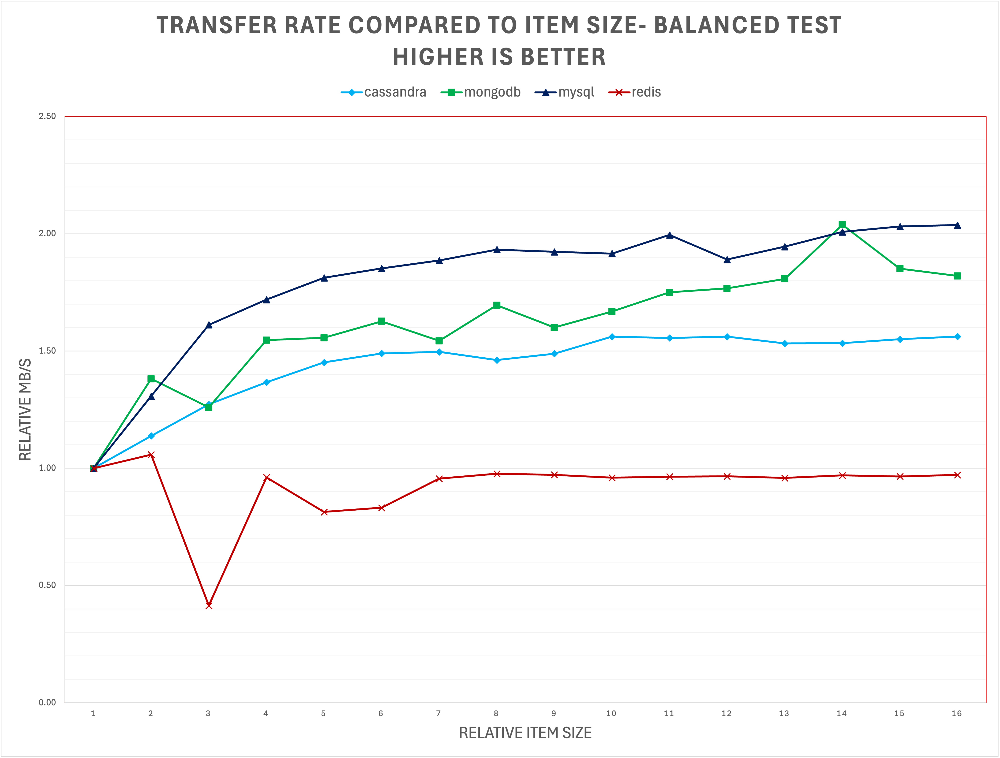
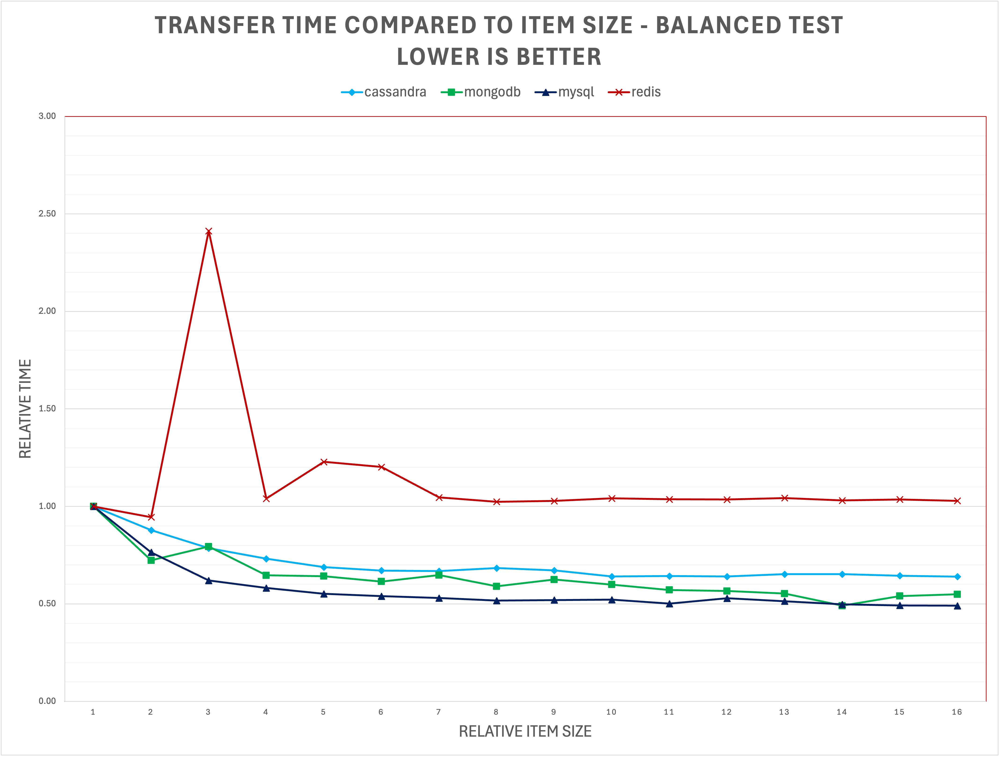
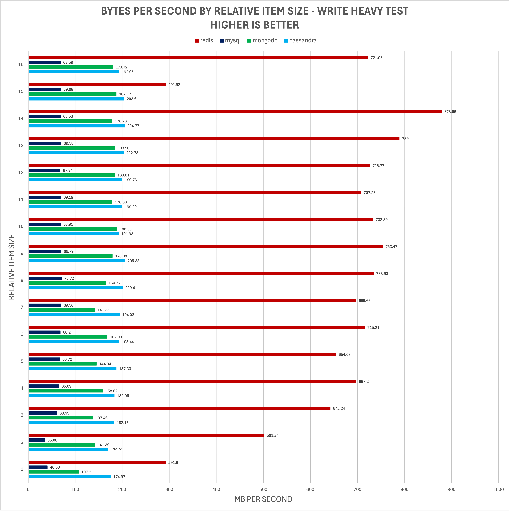
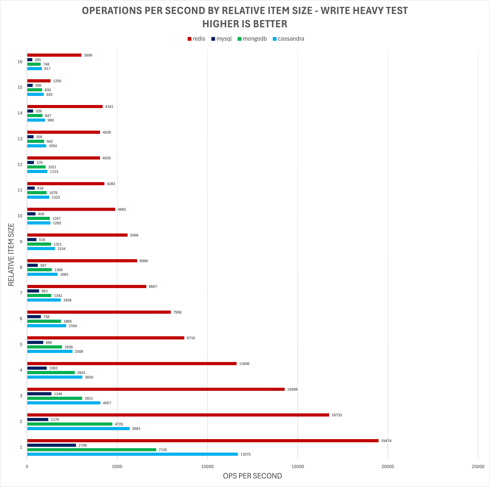
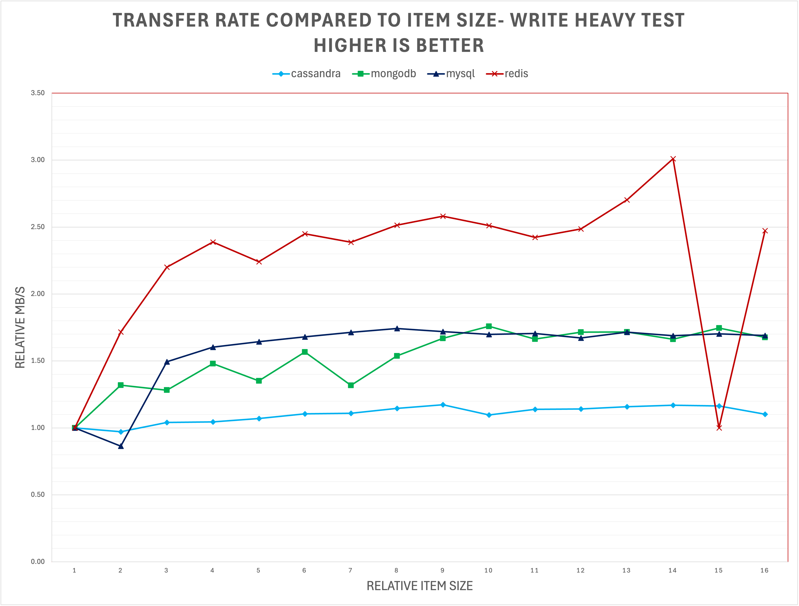
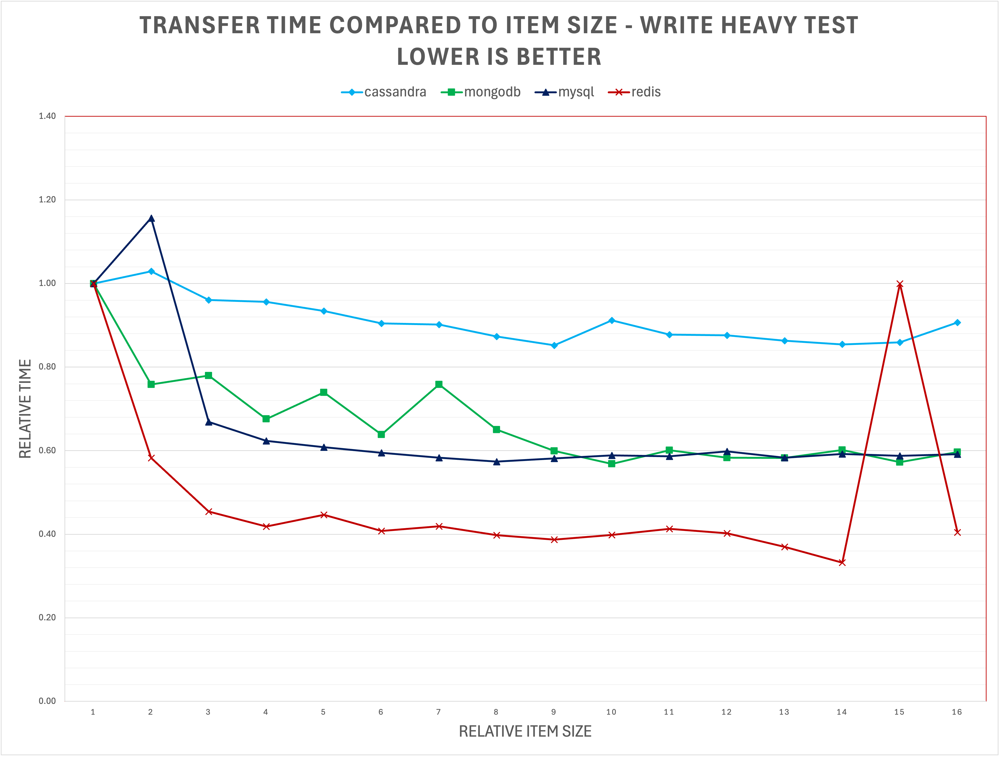

# Follow Up: Analyzing the Potential Benefits of Denormalization

The results of the prior testing seemed to indicate the denormalizing a NoSQL database may have significant benefits
to application performance. This test seeks to further shed light on these potential benefits.

## Introduction & Setup
All tests will use a starting value of a large text, i.e. a series of random strings between 10-20 kilobytes. The size 
of objects are referred to as a "relative size" or "relative item size." To calculate the true size of an object based 
on relative item size, take the base item size (10-20KB) and multiply both the lower and upper limit by the relative item size.
Below are several examples of relative item size mapping:
* Relative item size 1 - random payloads between 10 and 20 KB. 10KB * 1 = 10KB and 20KB * 1 = 20KB.
* Relative item size 5 - random payloads between 50 and 100 KB. 10KB * 5 = 50KB and 20KB * 5 = 100KB.
* Relative item size 8 - random payloads between 80 and 160 KB. 10KB * 8 = 80KB and 20KB * 8 = 160KB.
* Relative item size 16 - random payloads between 160 and 320 KB. 10KB * 16 = 160KB and 20KB * 16 = 320KB.

Results will be judged by their transfer rates and transfer times measured in bytes/seconds and seconds/bytes respectively.

**Note**: This will not consider the additional write cost of denormalization, but the cost of this tradeoff should
quick to calculate.

## Benchmarks & Analysis

  

Click for additional charts & details

All databases significantly benefited from denormalization here except Redis, which did not show any consistent improvements.
I expect Redis benefits significantly from denormalization, but the point of diminishing returns has already been reached. 
Given the results of the prior report, I expect denormalizing Redis would show significant benefits with the small 
texts (100-200B) category.

The other three databases showed a ~3x improvement between a 1 and 16 relative item size. This is to say that 3x 
the data can be transferred in the same amount of time with 16x normalization.

  

Click for additional charts & details

The results of the balanced test are largely similar to the read-heavy test, albeit to a lesser degree. Redis again showed
no improvement, but the other three database showed a ~1.75x B/s speedup.

  

Click for additional charts & details

In a reversal of the two previous tests, Redis benefits noticeably from denormalization and the other three databases 
showed less notable results. It should be noted that while MySQL shows noticeable improvements from denormalization, 
any benefits are likely to be erased when multiple write operations are required.

## Conclusion
This report shows that denormalization can have a significant impact on performance under the right conditions. Cassandra, 
MongoDB and MySQL all showed noticeable benefits from denormalization, up to a 3.4x performance uplift. Redis showed a 
surprisingly small improvement from denormalization, but this is likely due to payload size. Given 
the B/s improvements Redis showed when moving from small texts to large texts, it's likely Redis would benefit from
denormalization when objects are around 100 bytes.  **This indicates there may be a certain "sweet spot" of payload size 
where denormalization will have a larger positive effect.**

