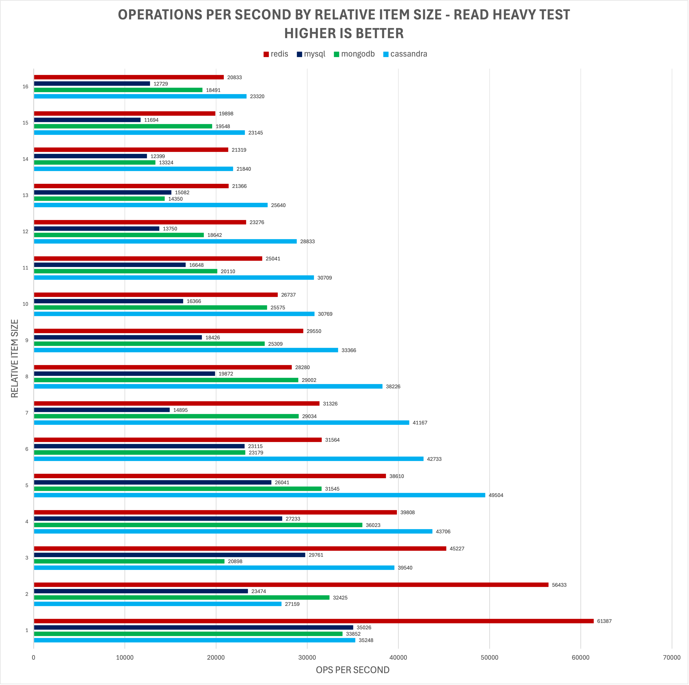

# Comparing NoSQL Database Performance for Small Dataset Key/Value Lookups

## Info
**Purpose**: This analysis is  https://api.heinz.cmu.edu/courses_api/course_detail/95-737/
**Note**: Results have 

## Usage

**Running the test**

Run

**Running the analysis script**
Ensure the venv has been activated and requirements have
```shell
python cmd/analyze/main.py
```

## Description
This project looks to compare the performance of several popular NoSQL databases. Specifically, it will consider 
relative performance when querying small (<2.5GB) datasets that fit entirely in memory. The three NoSQL databases that will be considered are: 
Redis, MongoDB and Apache Cassandra. Although Redis has a significant edge both in how it stores data (in-memory vs 
persistent disk) and its key/value database type, it will be valuable to see the relative performance between them, 
which will be analyzed later in this report. This report seeks to provide a general idea of the relative performance of 
these databases.

In addition to the aforementioned databases, a common SQL database will be introduced in order to provide a more 
well-rounded test. In the real world, the NoSQL options may be compared to a SQL database like MySQL, so having it as a
reference will make this more applicable to real-world scenarios.

## Inclusions
This report will include the following testing scenarios:
- Simple key/value queries 
- Various NoSQL database types (as well as MySQL as a reference)
- Various data sizes (ranging from hundreds of bytes to megabytes)
- Various read/write patterns to account for different use-cases 
- All relevant databases use indexes where applicable

## Exclusions
This analysis will not factor in or consider the following scenarios:
- Scalability across multiple (many) nodes 
- Flexibility of developer’s querying or different query types 
- Performance of different query types and schemas 
- Different data compression methods 
- Optimized or highly optimized schemas and hardware configurations

## Relevant Use Cases
This analysis will be relevant when choosing a database when considering small scale:
- Caching
- Comment data store (e.g. social media post, comment section post)
- Static text store (e.g. frequent referenced books snippets, blog and forum posts)
- Image data store
- Rapid key/value lookups of any data size between 100B and 2MB

## Test Setup
### Test App
A multi-threaded Go application will be created to run all tests. It will run on a sufficiently large AWS instance to 
avoid any bottlenecks. A 32-core c7g.8xlarge instance will be used to run the testing program. Post-processing analysis 
will be done via a Python script and Microsoft Excel.

### Test Data
A variety of different scenarios will be considered to evaluate all listed databases. Benchmarks will consider three 
different data sizes:
1.	Small text (100-200B)
2.	Large text (10-20KB)
3.	Image (1-2MB)

Separating the dataset into these categories will provide insight of the relative performance of these datasets for 
different use cases. Small text may include data like “tweets”, large text may include larger snippets of text (like 
chapters), and the images category will represent data the size of images (jpeg or smaller pngs) and books. 
Additionally, these categories will provide insight between lookup times and data transfer speeds.

For all three tests, approximately 1.5GB will be added to the databases to start.

### Performance Evaluations
Additionally, benchmarks will consider three different read/write scenarios:
1.	Write-heavy scenarios (10/90 reads/writes)
2.	Balanced (50/50 reads/writes)
3.	Read-heavy scenarios (90/10 reads/writes)

This will provide insight of the performance across many use cases. Customers may have use-cases that highly favor 
write-operations, or the opposite depending on what they are doing. To provide an example, IoT event logging is often 
write-heavy, as IoT devices will announce many events that are rarely analyzed. In contrast, CDN caches are often 
read-heavy, since they often serve frequently accessed data to users.

Databases will be evaluated on two key metrics: operations per second (or requests per second), and bytes per second. 
Operations per second provide a clear understanding of how a database may be used to fulfill business requirements. 
For example, a certain business partner may expect approximately 10 thousand requests per second, and they may need a 
database that can handle the corresponding throughput.

Bytes per second will provide insight into the cost of a database lookup. This is a valuable metric, because it may 
provide insight as to the performance benefits of denormalization. If lookups are the costliest part of the request, it 
may be beneficial to denormalize data and have a single record.

### Database Setups
To provide a simple and standard environment for all databases to run in, a single instance will be used for all 
databases. All tests will be performed on an AWS, I/O optimized EC2 instance. The VM specs will be as followed:

•	OS (Amazon AMI): Ubuntu Server 24.04 LTS
•	Architecture: 64-bit x86
•	Instance Type: i4i.large
•	Storage: 468GB Ephemeral

The instance will use the popular and reliable x86-64 architecture, powered by an Intel processor. It will used fast, 
local ephemeral storage that should enable excellent I/O performance. It should be noted that while AWS EC2 i-series 
instances are widely recommended for database workloads, they may not be the ideal choice in all cases. For example, M series instances with the proper EBS configurations may be a better choice for Redis instances. Again, this report will only provide a high-level understanding of relative performance.


## Benchmarks
### Operations (or Requests/Transactions) Per Second


### Bytes Per Second


## Analysis
The above testing yielded several interesting results.

- All three hybrid databases (that use both RAM and disk) performed similarly in the read-heavy test, but results vary greatly in the write-heavy test. In the 90/10 write/read test, Cassandra performed the best and MySQL performed the worst. 
- The operating system will cache frequently accessed files, which helps the databases to achieve maximum performance (Figure 1). 
- All four databases performed fairly similar when reading images. This may be due to the images being cached to memory. 
- Redis consistently performed excellent, which is to be expected since all data is stored in memory and it offers O(1) gets and sets [2][3]. Furthermore, it is a key/value store database, which it what this test favors.  
- Mongo DB performance is much closer to Redis than initially expected for images. This may be due to MongoDB’s ability to store datasets entirely in memory (assuming enough is available) [1].  
- **Read vs write performance**
  - MySQL’s read-heavy performance was about four times greater than the write-heavy performance. This may be due to MySQL’s ACID guarantees.  ACID requires that MySQL lock the table before writes can be done, which greatly impacts performance. 
  - MongoDB’s performance stayed very consistent across all three tests. It is notable that MongoDB did not slow down when performing write operations. 
  - Cassandra’s write performance was much greater than the others, especially with the smaller payloads. Its write performance was about three times greater in the write-heavy test (compared to read-heavy) when looking at small texts. 
  - Redis consistently performs the best across all scenarios, with the exception being the images test, where it typically performed at least on par with the others. 
- **Small items vs large performance**
  - MySQL performed much better when working with large entries rather than small. Generally speaking, its performance was on par with the NoSQL database when looking at read-heavy scenarios. 
  - MongoDB consistently achieved a much higher bytes-per-second score when larger items are considered. It scored on par with Redis when comparing images, but much worse when comparing small texts. This may indicate a much slower lookup time on MongoDB. 
  - Cassandra was able to output 62 times more bytes on the read-heavy test and 20 times more on the write-heavy test comparing images to small texts, respectively. This may indicate the benefits of denormalization. In other words, outputting a single large record may be cheaper than outputting several small records. 
  - Redis consistently performed well across all tests, indicating a relatively low lookup cost. However, it was able to output 32x the byte count on the balanced test for images compared to small texts. This again indicates the potential benefits of denormalization.

  
Figure 1 A screenshot of htop while the MySQL test runs. The instance will cache data written to disk (orange bars above).

## Conclusion
This report demonstrates the relative performance of different NoSQL databases as well as a popular SQL database. 
It demonstrates that Redis performed excellent when looking up key/value pairs, which was to be expected. 
It also showed that that the write performance of the NoSQL databases compared to MySQL highlights an advantage over SQL 
databases. SQL databases, like MySQL, often use an ACID model, which has certain tradeoffs. It may be preferential when 
consistency is desired, but NoSQL databases like MongoDB’s default model provides much greater performance when performing 
write operations [4].

## Future Work
In order to future understand how these databases may be used effectively, the following areas could be explored further:
- Scalability across different cluster sizes 
- Applicability across different use cases and query types 
- Optimizing parameters to determine the limitations of each database

## References
[1] “FAQ: MongoDB Fundamentals,” MongoDB, https://www.mongodb.com/docs/manual/faq/fundamentals/#does-mongodb require-a-lot-of-ram (accessed Jul. 29, 2024).  
[2] “Set,” Redis, https://redis.io/docs/latest/commands/set/ (accessed Jul. 29, 2024).  
[3] “Get,” Redis, https://redis.io/docs/latest/commands/get/ (accessed Jul. 29, 2024).  
[4] “MongoDB vs. MySQL Differences,” MongoDB, https://www.mongodb.com/resources/compare/mongodb-mysql (accessed Jul. 29, 2024).

# Follow Up: Analyzing the Potential Benefits of Denormalization 

Important note: This will not consider the additional write cost of denormalziaton, but the cost of this tradeoff should
be easy to calculate.

Results will be judged 

How much can I speed up my application by denormaliting data?
Ofcourse, inidividual operation time will be slower, but overall data transfer rate will be (much) higher
It does seem like there are diminishing returns based on the size of the object. It seems there is a sepecific cost to lookups, and it becomes more neglibile the larger the payload is
How long does it take to transfer 16 items worth of data?


## Benchmarks
<details>  

  
</details>


## Analysis & Conclusion
